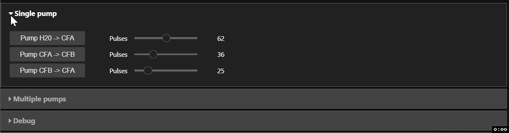

<!-- vim-markdown-toc GFM -->

* [Install (Windows)](#install-windows)
    * [Install MiniConda 3](#install-miniconda-3)
    * [Create Conda UI development environment](#create-conda-ui-development-environment)
* [Pump control user interface (Jupyter notebook)](#pump-control-user-interface-jupyter-notebook)
    * [Usage](#usage)
* [Develop Firmware (Windows)](#develop-firmware-windows)
    * [Install requirements](#install-requirements)
    * [Flash MicroPython to ESP32 board](#flash-micropython-to-esp32-board)

<!-- vim-markdown-toc -->

# Install (Windows)

## Install MiniConda 3

Download and install: https://repo.anaconda.com/miniconda/Miniconda3-latest-Windows-x86_64.exe

## Create Conda UI development environment

Start a command prompt or Powershell session and run the following:

```sh
conda init  # Initialize shell support for Conda
conda create -n esp32-pump -c conda-forge -c sci-bots nodejs astroid ecdsa isort lazy-object-proxy mccabe pylint pyserial typing websocket-client pyserial six jupyter notebook jupyterlab jupytext autopep8 ipywidgets asyncserial pyaes pyside2
conda activate esp32-pump
conda config --env --append channels conda-forge
jupyter labextension install @jupyter-widgets/jupyterlab-manager
git clone https://github.com/sci-bots/esp32-pump-driver
```

# Pump control user interface (Jupyter notebook)

Start a command prompt or Powershell session and run the following:

```sh
conda activate esp32-pump
cd esp32-pump-driver
jupyter lab
```

## Usage

1. Launch `notebooks/MicroPython RPC - pump UI.py` notebook
2. Run all cells.
3. Use IPython widgets to trigger pump actions:



-------------------------------------------------------------------------------

# Develop Firmware (Windows)

The following instructions are only required if you plan to modify the code
running on the ESP32 (not required for pump user interface).

See [`README-rpi.md`](README-rpi.md) for instructions for the Raspberry Pi 3.

## Install requirements

Start a **Powershell session** and run the following:

```sh
conda activate esp32-pump
pip install esptool
pip install mpy-repl-tool
python -m there.jupyter-setup
```

## Flash MicroPython to ESP32 board

1. Download the latest MicroPython for ESP32 [here][esp32-micropython] to
   `~\Downloads` (e.g., `C:\Users\christian\Downloads`).
2. Start a **Powershell session** and run the following:

```sh
conda activate esp32-pump
# Attempt to autodetect COM port
$ESP_PORT = $(python -c "import serial.tools.list_ports as lp; print('\\n'.join([p.device for p in lp.comports()]))" | Sort-Object | Select-Object -first 1)
# Attempt to autodetect esp32 MicroPython firmware
$ESP_MICROPYTHON = "$(Resolve-Path ~\Downloads\esp32*.bin | Sort-Object -Descending | Select-Object -first 1)"
esptool --port $ESP_PORT --baud 460800 erase_flash
esptool --port $ESP_PORT --baud 460800 --chip esp32 write_flash -z 0x1000 $ESP_MICROPYTHON
# Bootstrap with code
python -m there ls
python -m there push -r lib /
python -m there push -r app /
python -m there push -r boot.py /
```
3. Reset board and display serial output: `python -m there --reset -i`
 - Press `Ctrl+C` to enter read/execute/print loop (i.e., REPL).
 - Press `Ctrl+]` to quit.

Note that the code above assumes that the `$ESP_PORT` and `$ESP_MICROPYTHON`
environment variables are set to the serial port and the MicroPython firmware
file path, respectively.

[esp32-micropython]: https://micropython.org/download#esp32
